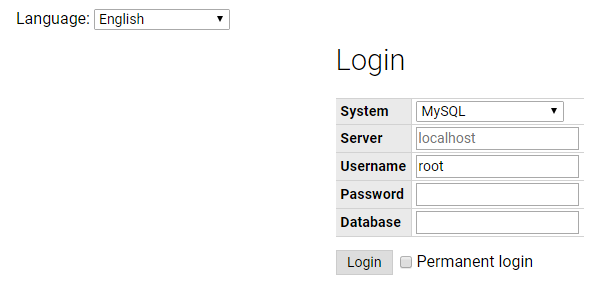
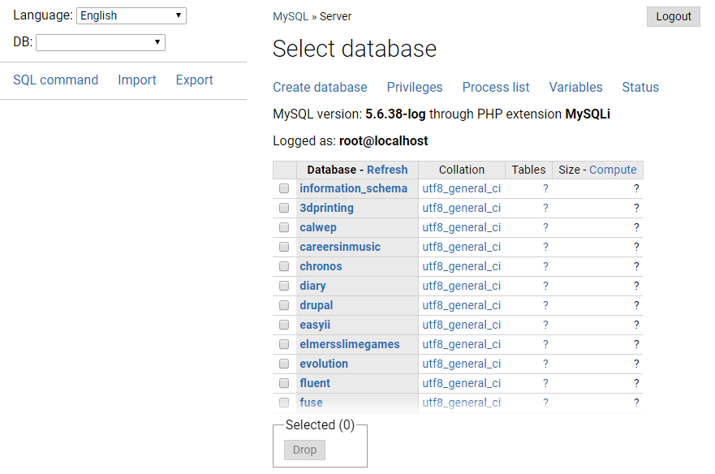
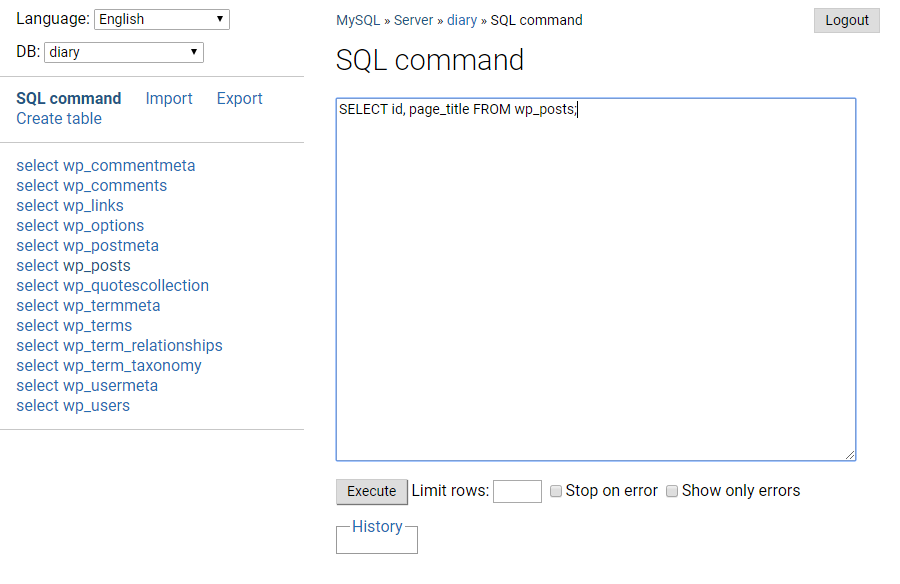
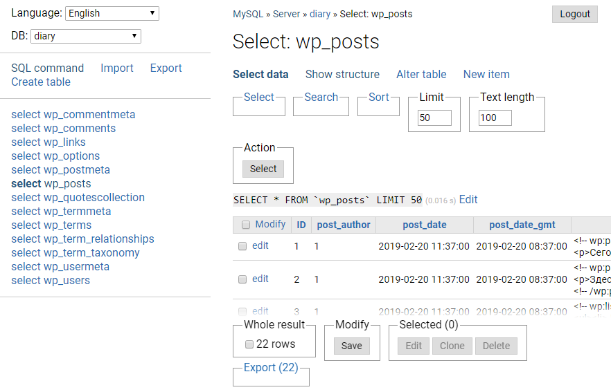
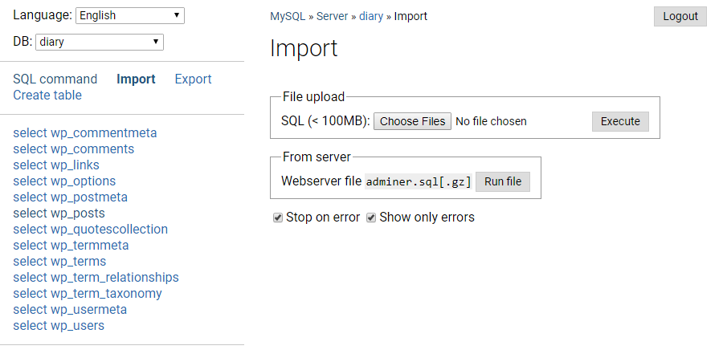
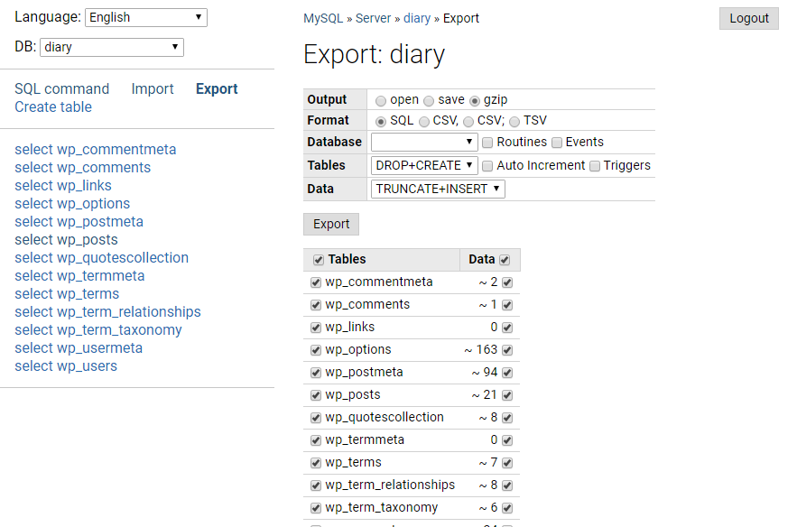

# Adminer

Adminer - Database management in a single PHP file.

It's custom build 4.6.2, where we do not need to enter a password when logging in Adminer, if you have not installed on the local environment.

The theme of the design is a modified theme Nicu - minimalism and speed.

- Supports: MySQL, MariaDB, PostgreSQL, SQLite, MS SQL, Oracle, SimpleDB, Elasticsearch, MongoDB, Firebird
- Requirements: PHP 5+

Main files:

- *adminer/index.php* - run development version of Adminer
- *editor/index.php* - run development version of Adminer Editor
- *editor/example.php* - example customization
- *plugins/readme.txt* - plugins for Adminer and Adminer Editor
- *adminer/plugin.php* - plugin demo
- *adminer/sqlite.php* - development version of Adminer with SQLite allowed
- *adminer/designs.php* - development version of Adminer with adminer.css switcher
- *compile.php* - create a single file version
- *lang.php* - update translations
- *tests/katalon.html* - katalon Automation Recorder test suite

Some screenshots:

https://www.adminer.org/